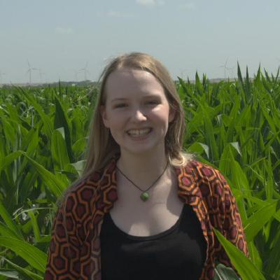

# Cassidy Lee

Hi, I’m Cassidy Lee, a master's student at Georgia Tech studying analytics!
I am also a full-time data scientist for Textron Aviation ✈️

# 🌽🌽🌽🌽🌽🌽🌽🌽🌽🌽🌽🌽🌽🌽🌽🌽🌽🌽🌽🌽🌽🌽🌽
Originally from Oklahoma 🤠 Now based in Wichita, Kansas 🌻

I am mostly interested in mathematics, but I also love working on data science projects and developing video games. I also like to spend time and talk math and data science with my identical twin sister, Christi Lee ([@Honeybee-Lee](https://github.com/Honeybee-Lee)).

📫 If you're looking to collaborate (or just feeling nerdy), feel free to reach me at casslee1351@gmail.com

Connect with me on [LinkedIn](https://www.linkedin.com/in/cassidylee1351/)!

<!---
casslee1351/casslee1351 is a ✨ special ✨ repository because its `README.md` (this file) appears on your GitHub profile.
You can click the Preview link to take a look at your changes.
--->
